#### Capstone Project
# Udacity - Cloud DevOps Engineer
## Scope

### Kubernetes cluster

Kubernetes cluster deployed on 2 EC2 instances (plane and worker nodes) hosted on AWS. Solution's components:

1. CloudFormation scripts / configuration files

   - IAM Roles definition -> [policies](cloudformation/policies/)
   - network configuration on AWS (note: public net based approach was used in the project)
     - [k8s-public-net](cloudformation/k8s-public-net/network.yml) - Kubernetes cluster hosted in public subnet
     - [k8s-private-net](cloudformation/k8s-private-net-with-bastion/network.yml) - Kubernetes cluster in private subnet accessible through bastion SSH host
   - EC2 instances deployment and configuration -> [k8s-public-net](cloudformation/k8s-public-net/k8s-hosts.yml)
   
2. Scripts to install and configure Kubernetes on plane and worker nodes

   - installation script for plane EC2 instance -> [master.sh](cloudformation/install-scripts/master.sh)
   - installation script for worker node -> [worker.sh](cloudformation/install-scripts/worker.sh)

3. Helper [Powershell scripts](helpers/public) to simplify configuration tasks and allow automated Kubernetes cluster initialization with single worker node. Following execution sequence from AWS CLI enabled client would initiate and install Kubernetes cluster on environment built by CloudFormation scripts, including worker node registration.

> `./init-master.ps1` -> `./install-master.ps1` -> `./init-worker.ps1` -> `./install-worker.ps1`

### CI/CD pipeline
Circle CI platform integrated with GitHub repository, Dockerhub account and AWS environment hosting Kubernetes cluster configured with CloudFormation. [Pipeline definition](.circleci/config.yml):

1. build .Net Core sample application that will display information required to verify deployment type
2. lint projects

   - [application project](testapp/) `dotnet format --verify-no-changes`
   - [Dockerfile](Dockerfile) `~/hadolint Dockerfile`
   
3. build and then publish docker image in Dockerhub
4. deploy the image on Kubernetes cluster seamlessly using [blue/green deployment](https://kubernetes.io/blog/2018/04/30/zero-downtime-deployment-kubernetes-jenkins/) (side-by-side deployments with blue/green services allow 100% application's availability during deployment and immediate rollback if necessary)

   - deploy new version on blue environment
   - run validation test(s) on blue environment
   - repoint green service from old to new production
   - run validation test(s) on green environment

### Deployment components

Deployment tasks of Circle CI pipeline implemented with Ansible and [required roles' configuration](.circleci/ansible/), bash scripts executed over SSH and [Kubernetes objects' configuration](k8s/) for env based deployments and blue/green service management.

## [Execution results](docs/EXECUTION-RESULTS.md)

### Environment setup

  
Click to expand

   #### CloudFormation setup

   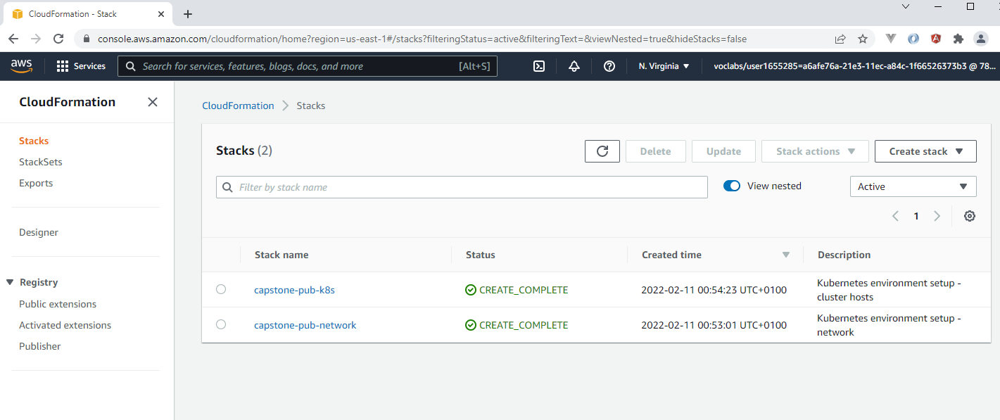

   #### Kubernetes setup

   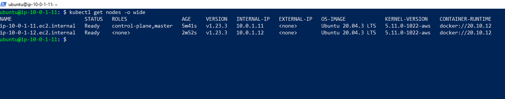

### CI/CD pipeline - failed linting

  
Click to expand

   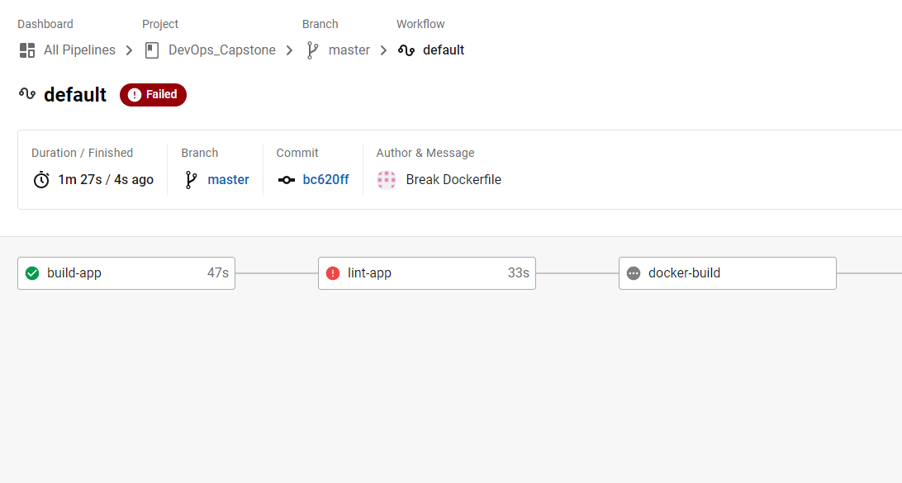
   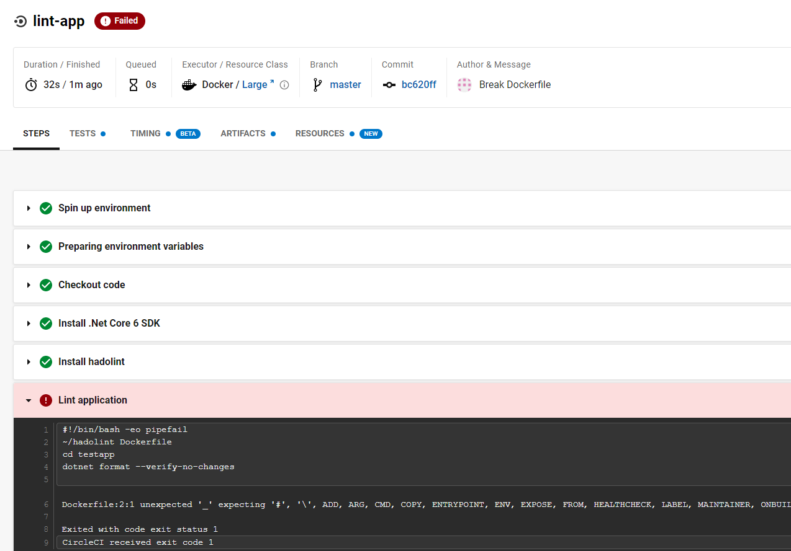

### CI/CD pipeline - Docker build and publish

  
Click to expand

   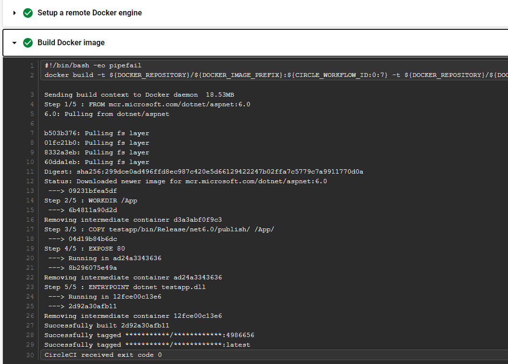
   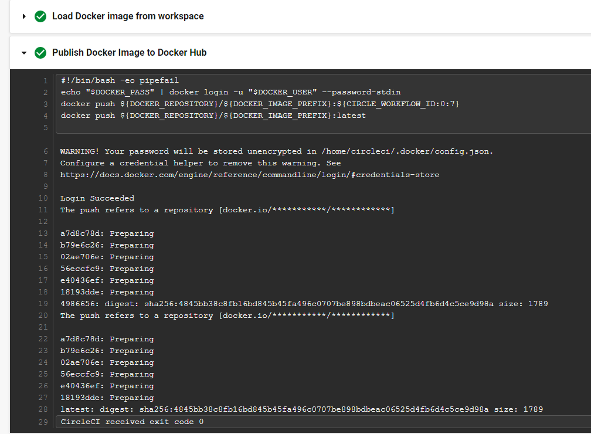
   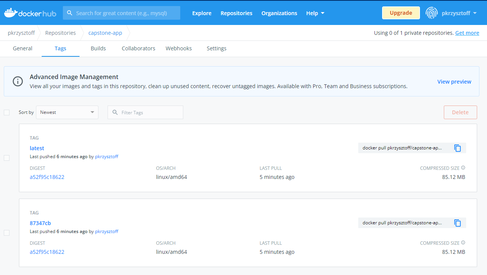

### Successful initial deployment

  
Click to expand

   > Green service configured on port 30001

   #### Pipeline view
   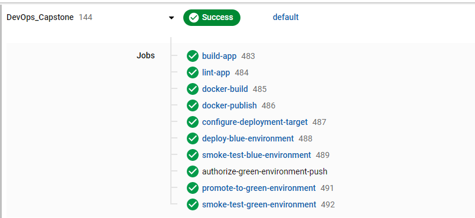
   #### Kubernetes view
   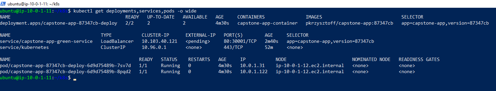
   #### Browser view
   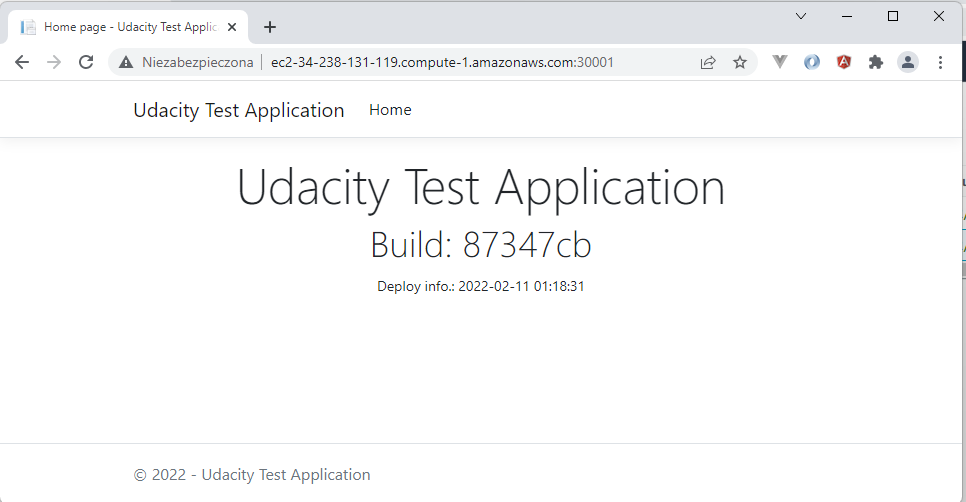

### Successful blue/green deployment

  
Click to expand

   > Green service configured on port 30001 (build ID: 87347cb)
   > Blue service configured on port 30002 (build ID: cd60dc4)

   #### Docker images
   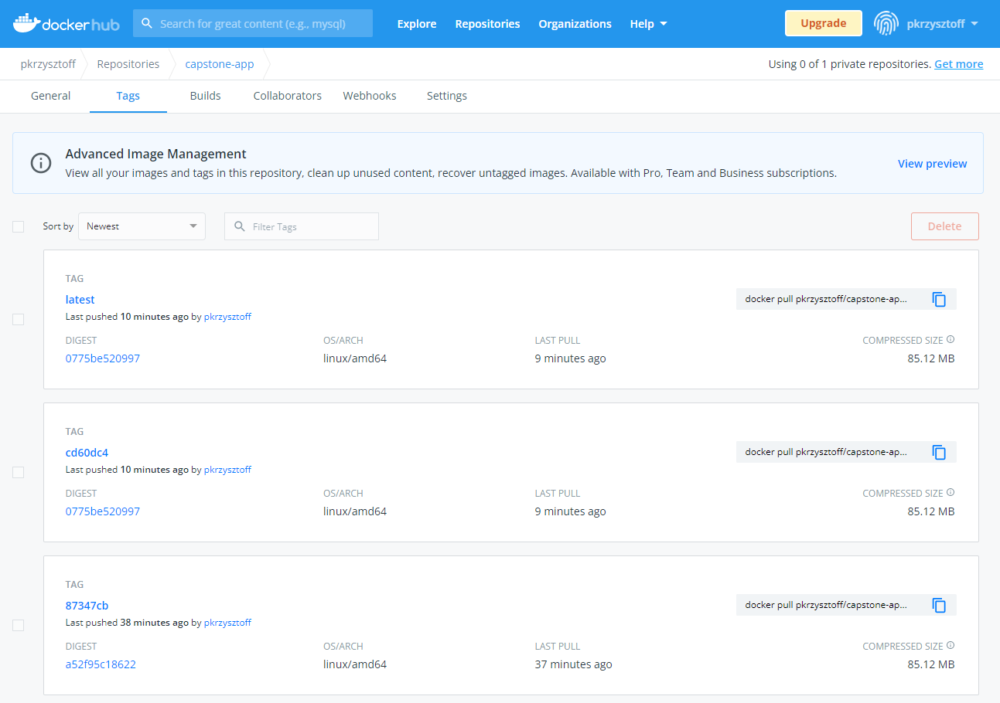
   #### Pipeline view
   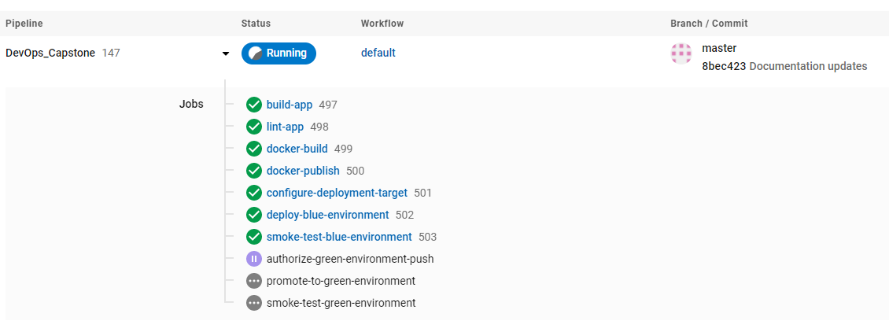
   #### Kubernetes view
   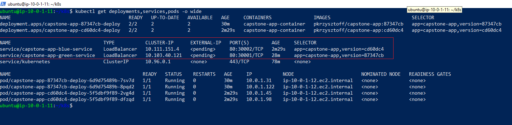
   #### Browser view
   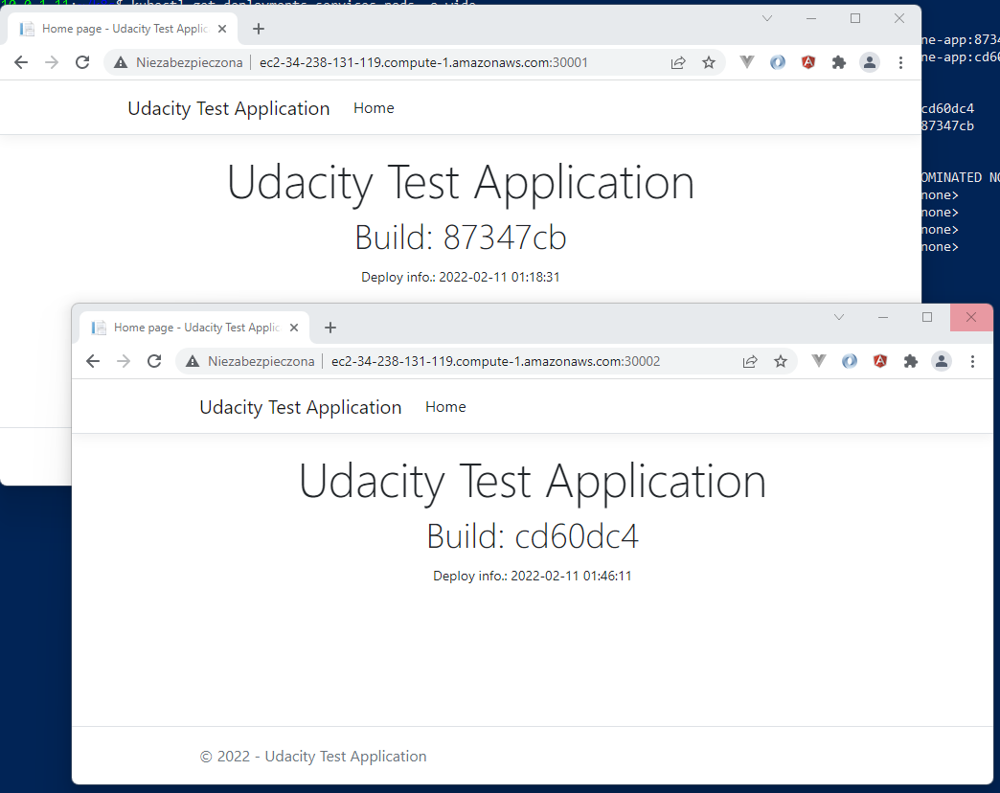

   > Promote to production

   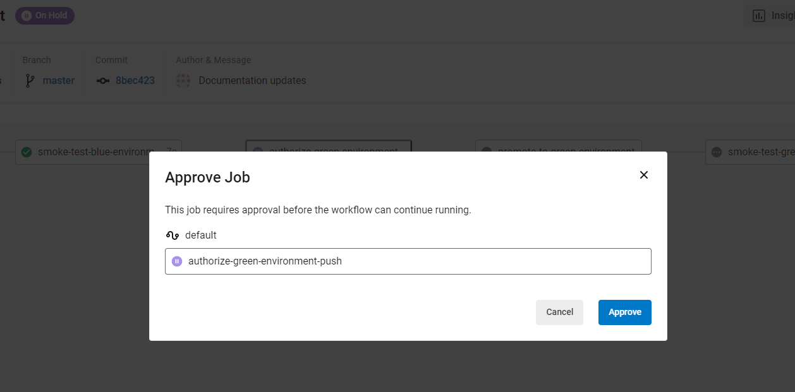

   > Green service repointed to deployment cd60dc4; old deployment 87347cb available for backout)
   > Blue service configured on port 30002 (build ID: cd60dc4)

   #### Pipeline view
   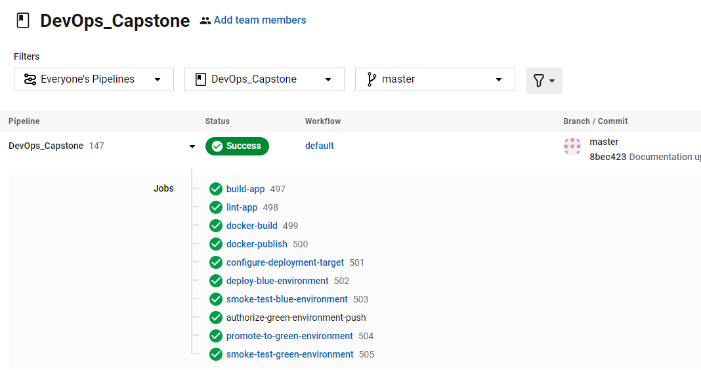
   #### Kubernetes view
   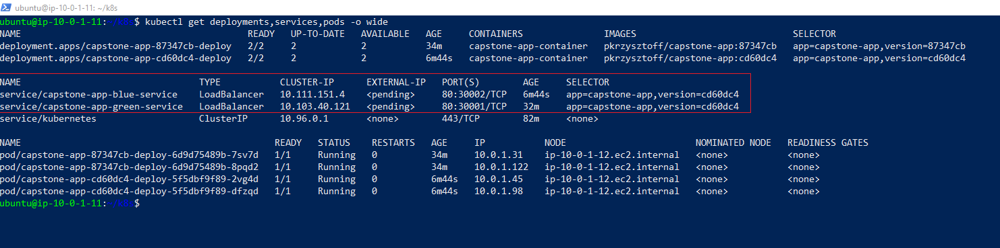
   #### Browser view
   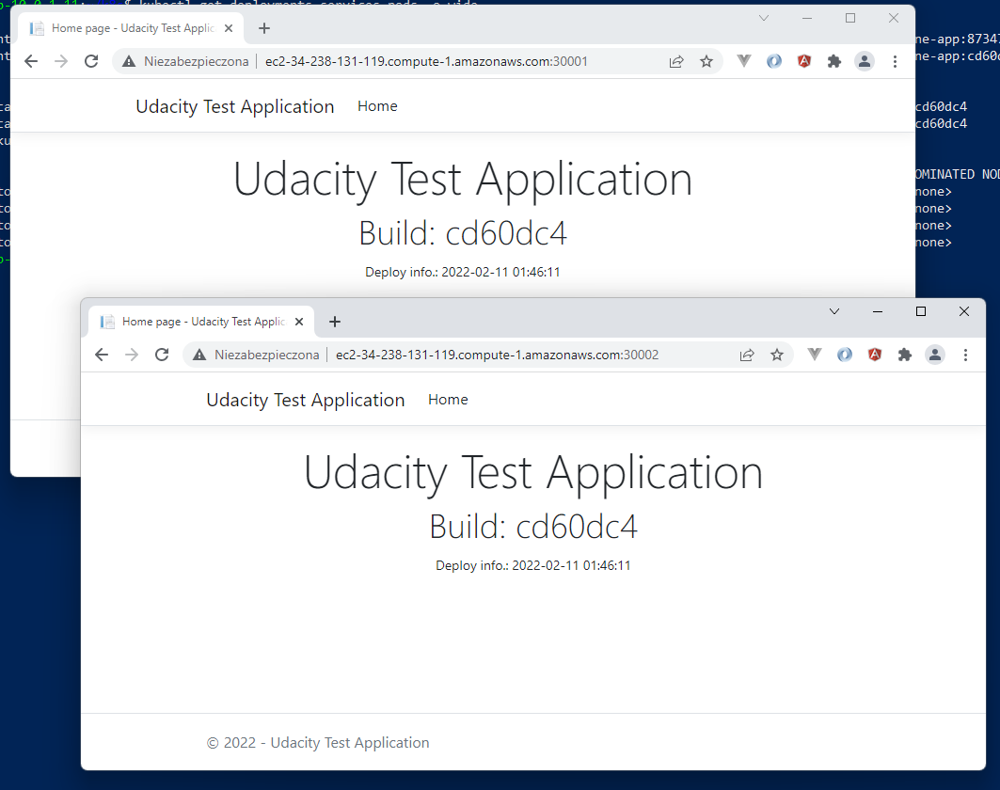

